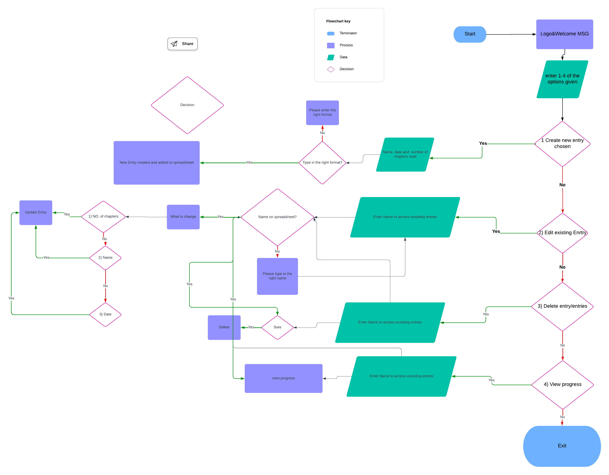
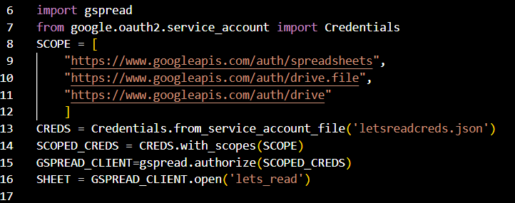
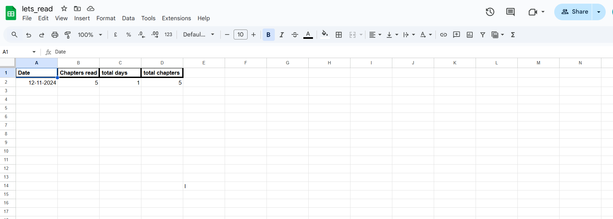

# Let´s Read

# Introduction
Project milestone 3 for Code Institute Full-stack development program: Python Terminal. <brZ>
Let´s Read is an application, which runs in the Code Institute mock terminal on Heroku. The main goal of the application is to help believers getting into the habit of regularly reading the Bible, by helping them track their bible reading habit.
There are several reading plans online and on the bible app.
[Live Project Here](deployed url)

## README Table Content

* [Introduction](#introduction)
* [User Experience UX](#user-experience---UX)
* [Design](#Design)
    * [Colours](#Colours)
* [Logic](#logic)
     * [Flowcharts](#flowcharts)

* Game Features
    * [Logo and Introduction Message](#Logo-and-Introduction-Message) 
    * [Ask User for a choice](#Ask-User-for-a-choice)
    * [Empty Input Alert](#Empty-Input-Alert)
    * [1 Create a new entry](#1-Create-a-new-entry)
    * [2 Edit Entries](#2-Edit-Entries) 
    * [3 Delete Entries](#3-Delete-Entries)
    * [4 View Entries](#4-View-Entries)
    * [Menu Options](#Menu-Options)
* [Storage Data](#Storage-Data)
* [Technologies Used](#technologies-used)
    * [Languages Used](#languages-used)
    * [Python Packages](#Python-Packages)
    * [Frameworks - Libraries - Programs Used](#frameworks---libraries---programs-used)
* [Testing](#testing)
    * [PEP 8 Online](#PEP-8-Online)
    * [Lighthouse](#Lighthouse)
    * [Functionality](#Functionality)
    * [Bugs](Bugs)
* [Deploying this Project](#deployment-this-project)
    * [Forking this Project](#forking-this-project)
    * [Cloning this Project](#cloning-this-project)
* [Credits](#credits)
* [Content](#content)

## User Experience - UX

### User Stories

* As a website creator, I want to:
  
1. Build an easy straightforward bible reading habit tracker.
2. Build a bible reading habit tracker app that the user can log in their habit, edit entries and delete them.
3. Give the user an overview of their reading habits.
   
* As a new visitor, I want to:

1. Be able to understand the purpose of the application.
2. Be able to track my bible reading habit and get motivated to keep on doing it.
3. Be able to create a new entry and get a full overview of my reading habit.
   
* As a returning visitor, I want to:

1. Be able to view past entries.
2. Be challenged and try to improve my habit and stay motivated to read the Word of God.
3. Be able to create a new entry, edit and/ or delete existing entries.
   
## Design

#### Colours
* The colours in the game are supplied by the Python Colorama Model

### Flowcharts 
 
I spent some time thinking about the logic and flow behind the tracker to ensure I had a general idea of how it could be built. By creating flowcharts have an overview of the logical flow and get back to it throughout the project. The charts were generated using [Lucidchart](https://lucid.app/) Integration and are shown below. 

## Features

### Logo and Introduction Message

* When the users open the application, they will see this feature. The logo and the intro message are displayed here. 

### Ask user for a choice

* After the user sees the introduction, the application will ask the user to input their option. 

#### Empty Input Alert

* If the user does not input any number or the number within the option, an alert will appear. 

## Game Features

### 1 Create a new entry
  

User can create a new entry

### 2 Edit Entries

  

* User can edit entries

### 3 Delete Entries

  
* User can delete one or more entries

### 4 View Entries 

  
*Users can view all of their entries

### Menu Options

* In the beginning of the game users will have access to the menu where they can choose from these options:  
[1] - Create new entry  
[2] - Edit Existing Entry  
[3] - Delete Existing Entry  
[4] - View Entries

## Storage Data

Google sheet is used to save the user´s name, chapters read, date and store the calculated total days and chapters read so far.  As in the Love_Sandwiches shown this Google sheet is connected to the code through the Google Drive and Google Sheet API by the Google Cloud Platform. This allows me to send and receive data as having access to the Google Sheet API credentials. In the Config Vars I have to add credentials when deploying the project in Heroku. I also have to add the letsreadcreds.json in the Git ignore file so that these credentials are not pushed to the repository.

### Code to Connect to Google Sheet

### Google Sheet 

## Technologies Used
### Languages Used 

* [Python](https://www.python.org/)

#### Python Packages

* [Random](https://docs.python.org/3/library/random.html?highlight=random#module-random): returns a random integer to get a random word
* [Datetime](https://pypi.org/project/DateTime/): returns the full date
* [Gspread](https://pypi.org/project/gspread/): allows communication with Google Sheets
* [Colorama](https://pypi.org/project/colorama/): allows terminal text to be printed in different colours / styles
* [google.oauth2.service_accoun](https://google-auth.readthedocs.io/en/stable/index.html): credentials used to validate credentials and grant access to Google service accounts
  
### Frameworks - Libraries - Programs Used

* [Git](https://git-scm.com/)
    * Git was used for version control by utilizing the Gitpod terminal to commit to Git and push to GitHub
* [GitHub](https://github.com/)
    * GitHub is used to store the project's code after being pushed from Git
* [Heroku](https://id.heroku.com)
    * Heroku was used to deploy the live project
* [Lucidchart](https://lucid.app/)
    * Lucidchart was used to create the flowchart
* [PEP8]( https://pep8ci.herokuapp.com/
    * The PEP8 was used to validate all the Python code
* [Patorjk](https://patorjk.com)
    * Patorjk (ASCII Art Generator) was used to create logo

## Testing

### PEP 8 Online

The [PEP8]( Validator Service was used to validate every Python file in the project to ensure there were no syntax errors in the project.

  ## Functionality 
* The Application access the google spreadsheet successfully

## Bugs 
### Project is unfinished
Due to time management reasons the project is not ready and incomplete

## Deploying this Project

* This application was deployed by completing the following steps:

1. Logging in to [Heroku](https://id.heroku.com) or first create an account if not already
2. On the main page click the dots-menu icon in the top right corner next to your avatar and choose dashboard
3. On the your dashboard click the menu dropdown new and choose create new app
4. Type in your desired app name
5. Next select your region
6. Click on the Create App button
7. The next page is the project’s Deploy Tab. Click on the Settings Tab and scroll down to Config Vars
8. Click Reveal Config Vars and enter port into the Key box and 8000 into the Value box and click the Add button
9. Click Reveal Config Vars again and enter CREDS into the Key box and the Google credentials into the Value box
10. Next, scroll down to the Buildpack section click Add Buildpack select python and click Save Changes
11. Repeat step 8 to add node.js. o Note: The Buildpacks must be in the correct order. If not click and drag them to move into the correct order
12. Scroll to the top of the page and choose the Deploy tab
13. Select Github as the deployment method
14. Confirm you want to connect to GitHub
15. Search for the repository name and click the connect button
16. Scroll to the bottom of the deploy page and select the preferred deployment type
17. Click either Enable Automatic Deploys for automatic deployment when you push updates to Github

## Forking This Project

* Fork this project by following the steps:

1. Open [GitHub](https://github.com/)
2. Click on the project to be forked
3. Find the Fork button at the top right of the page
4. Once you click the button the fork will be in your repository

## Cloning This Project

* Clone this project by following the steps:
  
1. Open [GitHub](https://github.com/)
2. Click on the project to be cloned
3. You will be provided with three options to choose from, HTTPS, SSH, or GitHub CLI, click the clipboard icon in order to copy the URL
4. Once you click the button the fork will be in your repository
5. Open a new terminal
6. Change the current working directory to the location that you want the cloned directory
7. Type git clone and paste the URL copied in step 3
8. Press Enter and the project is cloned

## Credits

### Content

* All the content in the game is inspired by the CI Love_Sandwiches walkthrough and by peer projects [toni118g´s doctor-diary](https://github.com/Tony118g/doctor-diary) as well as [PedroCristo´s portfolio_project_3](https://github.com/PedroCristo/portfolio_project_3) for readme and style of the instruction
* The terminal function and template for the deployable application was provided by [Code Institute - Template](https://github.com/Code-Institute-Org/python-essentials-template)

  
### Information Sources / Resources

* [W3Schools - Python](https://www.w3schools.com/python/)
* [Stack Overflow](https://stackoverflow.com/)
* [Programmieren lernen](https://www.youtube.com/@Programmierenlernen)
* [Geek for Geeks](https://www.geeksforgeeks.org/)

## Special Thanks

  * Special thanks to the CI walkthrough project love-sandwiches and youtube tutorials and other sources on the internet.

